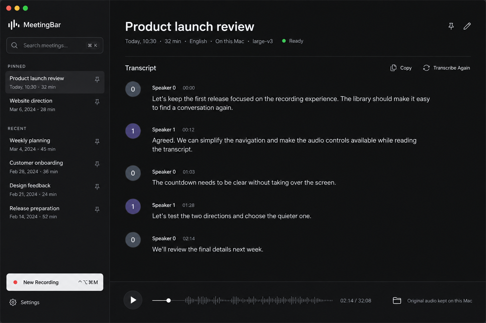
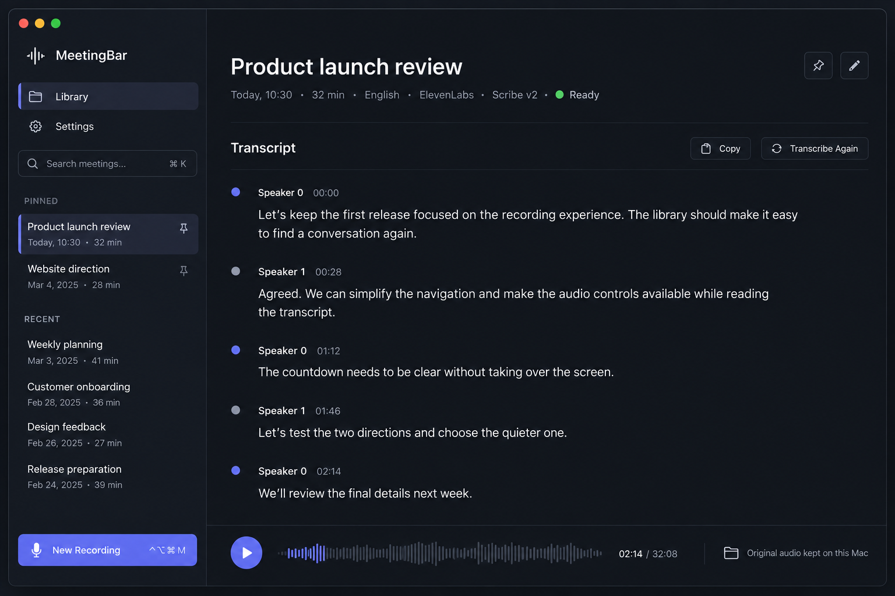
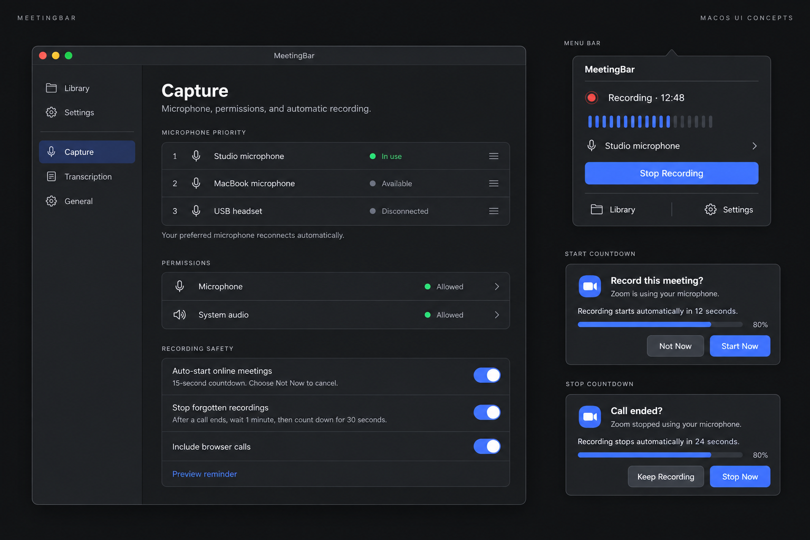

# MeetingBar: dark UI directions

Design exploration, 2026-09-17. These images are generated concept studies, not screenshots. Graphite was selected and applied to the native app for v1.5.0. The countdown implementation was separately committed and pushed to `main` as `da9b2f9` before this exploration.

## Concepts

1. [Graphite Library](01-graphite-library.png): mostly monochrome, quiet selection, flatter layout, readable transcript, persistent audio controls. Recommended starting point.
2. [Midnight Library](02-midnight-library.png): dark slate with a restrained indigo accent and more explicit navigation.
3. [Settings and recording controls](03-controls-and-prompts.png): compact settings rows, menu-bar recording controls, and explicit start/stop countdown prompts.

## What was inspected

Computer control was verified against the installed `/Applications/MeetingBar.app`, with the main window open. Live views inspected with accessibility navigation and screenshots:

- Library and speaker-separated transcript.
- Source-audio playback controls, without playing private audio.
- Search with no results; search was cleared afterward.
- Delete confirmation; canceled without deleting anything.
- Capture settings: microphone priorities, permissions, recording safety.
- Transcription settings: provider, language, model, credential UI, processing status.
- General settings: shortcut, login launch, retention, consent.
- Onboarding: opened through Window > Welcome to MeetingBar, without resetting setup or submitting the form.

The safe reminder preview was triggered, but the native window capture remained attached to the main window rather than the floating panel. Existing native renderer screenshots from the countdown tests provide the start/stop visual reference. The menu-bar popover and active-recording/processing/error states were reviewed in source, not fully exercised live. No real recording, cloud transcription, deletion, credential update, or permission change was performed for this review.

## Recommended direction

Use Graphite as the foundation, with the small speaker markers of Midnight and the compact settings grouping of the controls sheet. Keep native macOS window behavior. Reduce nested cards, oversized icon tiles, explanatory boilerplate, and persistent purple decoration. Put playback in a stable footer so it is available while reading long transcripts. Reserve sidebar action space and keep one-line truncation to prevent hover layout shifts.

The images are approximate design studies, not specifications. Generated speaker timestamps, waveform details, example dates, and the pictured search shortcut are illustrative and should not be treated as existing capabilities or approved feature additions. The selected implementation should retain actual supported behavior. Single-speaker transcripts should still omit speaker prefixes.

## References and generation

- [Vercel Geist](https://vercel.com/geist/introduction): design-system reference for hierarchy, typography, contrast, and restraint.
- [Stripe Payments](https://stripe.com/payments): product-design reference for information grouping and polished controls.
- [Exact prompts](PROMPTS.md): built-in image generation, one call per concept. All content is fictional; no private product screenshots were uploaded to the image tool.

## First native implementation

- Shared Graphite colors, flat surfaces, neutral buttons, restrained corner radii, and a monochrome waveform mark. App windows use dark appearance without changing the macOS appearance setting.
- Library: Settings navigation in the sidebar footer, quieter meeting rows, permanently reserved inline-action space, a flatter transcript layout, and small speaker markers.
- Playback stays in the detail footer outside the transcript scroll view. Audio preparation still only starts when Play is pressed.
- Capture, Transcription, General, onboarding, menu-bar controls, and countdown prompts use the same shared styling. No recording, provider, credential, or storage behavior was changed.
- The empty-library transcription description now reflects the selected local/cloud provider.

Validation: Debug suite passed (118 tests, 5 optional real-model tests skipped, zero failures). Release build and stable-signature validation passed. Native countdown renderer attachments verified start, call-ended, and silence layouts. The signed Release build was installed in `/Applications/MeetingBar.app` with the previous app backed up outside the repository; user data was untouched.

Live computer-use checks covered the Library at wide and narrower window sizes, meeting switching, a long transcript with persistent playback, search/no-results/reset, all three settings pages, and onboarding (closed without submitting). The original window size was restored and the Library left open. No real recording, cloud request, credential change, or playback of private audio was performed. Menu-bar styling was reviewed in source and still needs a live visual pass. Hover action widths are reserved in the view hierarchy; a full pointer-hover check remains manual.

## Follow-up visual review

A second computer-use pass found and fixed two issues: enabled secondary buttons looked too dim, and switching meetings/settings sections retained the previous scroll offset. Refresh/reminder buttons now have explicit high-contrast styling; each meeting or settings section starts at the top. Both changes were rechecked in the installed app. The deletion confirmation was inspected and cancelled without deleting anything. Compact and wide Library layouts, the pinned playback footer, and all settings sections were reviewed again; original window dimensions and meeting selection were restored.

The final build passed the same 118-test suite (5 optional tests skipped, zero failures), was signed with the stable designated requirement, and was installed. Its executable SHA-256 is `79900397a009768ec026aac7b8c5fcb40996c38a640ac08c855e8055b9040c37`. Direct menu-bar pop-up and real pointer-hover checks remain limited by computer-control access; no full live verification is claimed for those states.
